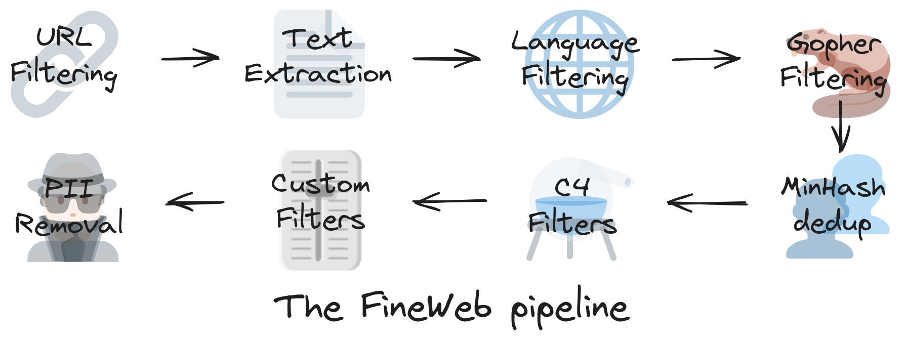
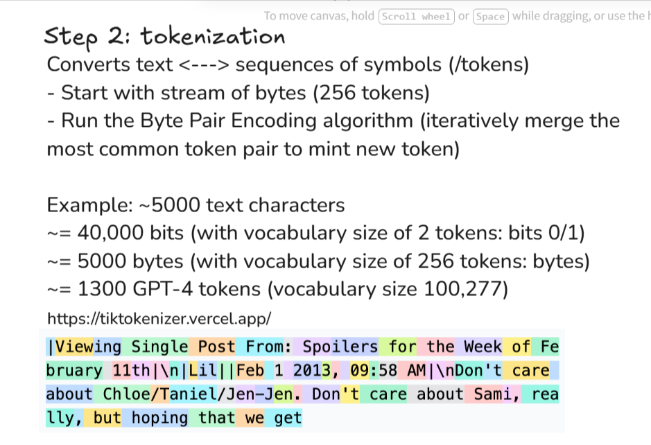
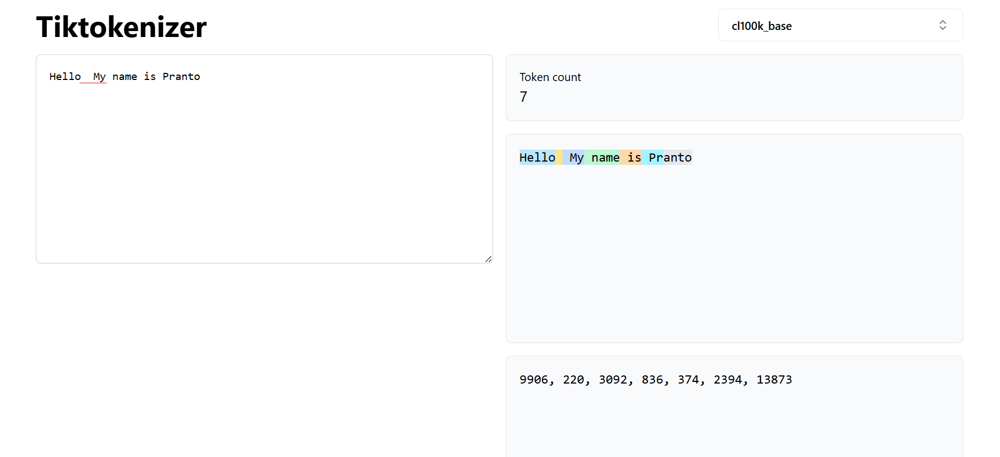
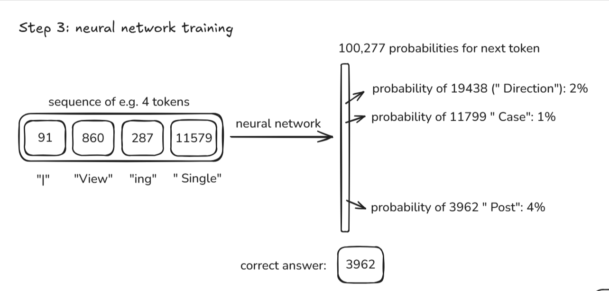
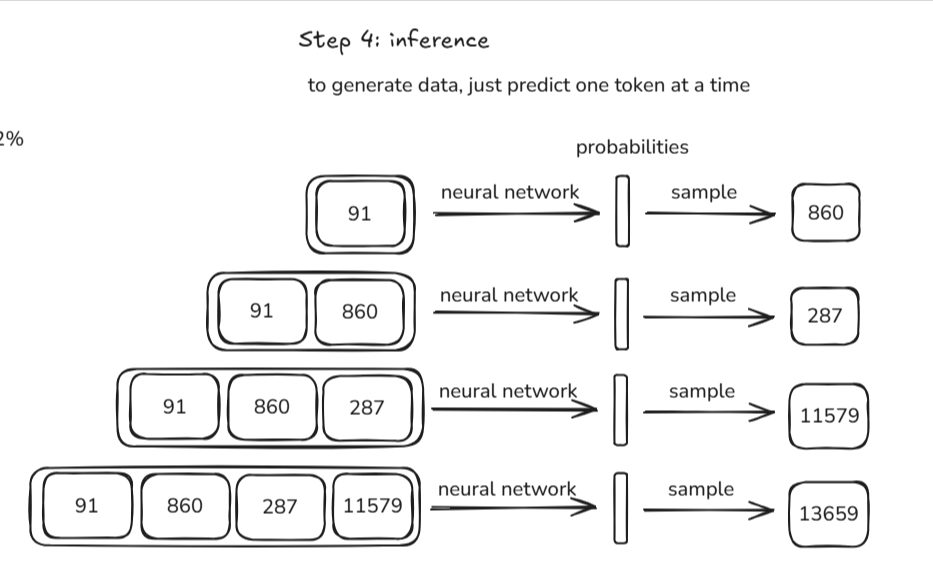

# 🧠 Deep Dive into LLMs like ChatGPT — Study Notebook

> A structured study companion for **Andrej Karpathy's** ~3.5-hour talk *"Deep Dive into LLMs like ChatGPT."*

**Video:** https://www.youtube.com/watch?v=7xTGNNLPyMI
**Article (TL;DR with images):** https://anfalmushtaq.com/articles/deep-dive-into-llms-like-chatgpt-tldr
**Speaker:** Andrej Karpathy · **Length:** ~3h 31m · **Audience:** General / technically curious

---

- The **one-line mental model** for the whole video:

> An LLM assistant is a neural network that is (1) **pretrained** on the internet to absorb knowledge, (2) **fine-tuned** to imitate helpful human labelers, and (3) **reinforcement-trained** to reason. Everything else is detail.

---

## 🗺️ Table of Contents

**Part 1 — Pretraining (building the base model)**

1. [Introduction](#1-introduction)
2. [Pretraining data: the internet](#2-pretraining-data-the-internet)
3. [Tokenization](#3-tokenization)
4. [Neural network I/O](#4-neural-network-io)
5. [Neural network internals](#5-neural-network-internals)
6. [Inference](#6-inference)
7. [Case study: GPT-2](#7-case-study-gpt-2)
8. [Base models in the wild (Llama 3.1)](#8-base-models-in-the-wild-llama-31)

**Part 2 — Post-training: Supervised Fine-Tuning (making an assistant)**
9. [From pretraining to post-training](#9-from-pretraining-to-post-training)
10. [Conversations &amp; the data behind SFT](#10-conversations--the-data-behind-sft)
11. [The psychology of an LLM](#11-the-psychology-of-an-llm)

**Part 3 — Reinforcement Learning (teaching it to think)**
12. [Reinforcement learning intro](#12-reinforcement-learning-intro)
13. [DeepSeek-R1 &amp; reasoning models](#13-deepseek-r1--reasoning-models)
14. [The AlphaGo analogy](#14-the-alphago-analogy)
15. [RLHF: RL from Human Feedback](#15-rlhf-rl-from-human-feedback)

**Part 4 — Wrapping up**
16. [Preview of things to come](#16-preview-of-things-to-come)
17. [Keeping track of &amp; finding LLMs](#17-keeping-track-of--finding-llms)
18. [Grand summary](#18-grand-summary)

[📖 Glossary](#-glossary) · [✅ Self-test answers](#-self-test-answers)

---

# PART 1 — PRETRAINING

## 1. Introduction

*(~00:00)*

- Goal of the talk: give a **complete but accessible mental model** of what happens when you type into ChatGPT and hit enter.
- The magic box is demystified into **three training stages**: **pretraining → supervised fine-tuning (SFT) → reinforcement learning (RL)**.
- ⭐ Key framing: the text you get back is **generated one token at a time** by a neural network — not retrieved from a database.

---

## 2. Pretraining data: the internet

*(~00:01)*

**Goal:** obtain a huge, high-quality, diverse pile of text.

- Real datasets: e.g. **FineWeb** (from Hugging Face) — a cleaned-up snapshot of the public web, ~**44 TB** of text, on the order of **15 trillion tokens**.
- ⭐ The raw web is filtered through a pipeline before it can be used:
  1. **URL filtering** — remove spam, adult, malware, and other blocklisted domains.
  2. **Text extraction** — strip HTML/markup/nav to keep just the readable text.
  3. **Language filtering** — keep target languages (e.g. English above a threshold).
  4. **Deduplication** — remove repeated content.
  5. **PII removal** — strip personally identifiable info (addresses, SSNs, etc.).
- Takeaway: what a model "knows" is downstream of **which data survived this filtering**.

🧩 The talk shows sample rows of FineWeb so you can see it's just ordinary web text stitched together.

> 📷 **IMAGE:** *The FineWeb preprocessing pipeline diagram (URL → extract → language → dedup → PII).
> 
> *

---

## 3. Tokenization

*(~00:07)*

- Neural nets don't read characters or words — they read **tokens** (integers).
- ⭐ The scheme used is **Byte Pair Encoding (BPE)**: start from raw bytes and repeatedly merge the most frequent adjacent pairs into new symbols. This balances **vocabulary size vs. sequence length**.
- GPT-4's tokenizer has roughly **100,000+** possible tokens (~100,277 in `cl100k_base`).
- A token is often a **word, part of a word, or punctuation** — *not* a single letter.

🧩 Karpathy demos **Tiktokenizer** live:

- The same word can tokenize differently with/without a leading space (`" hello"` vs `"hello"`).
- Case, spacing, and rare words all change the token split.

⭐ **This has huge downstream consequences**: because the model sees tokens (chunks), it is *bad at* character-level tasks like spelling and letter-counting.

> 📷 **IMAGE:** *Tiktokenizer screenshot showing a sentence split into colored tokens.*
> 

---

## 4. Neural network I/O

*(~00:14)*

- The network is trained on one deceptively simple task: **predict the next token** given a window of previous tokens.
- **Context window** = the sequence of tokens the model looks at (finite length, e.g. thousands of tokens). Tokens outside it are invisible.
- Training signal: take real internet text, hide the next token, ask the model to predict it, and nudge the weights so the correct token becomes more probable. Repeat trillions of times.
- ⭐ The output is a **probability distribution over the entire vocabulary** for "what comes next."

> 📷 **IMAGE:** *Diagram: token window → neural net → probability distribution over next token.*
>
> 

---

## 5. Neural network internals

*(~00:20)*

- Inside is a **Transformer (giant mathematical expression)**: a big fixed mathematical function with billions of tunable **parameters (weights)**.
- Inputs (tokens) flow through layers of matrix multiplications + attention; the parameters are the "knobs" adjusted during training.
- ⭐ Important intuition: the network has **no memory of individual training documents**. Knowledge is *smeared* across billions of weights — a **lossy, probabilistic compression** of the training data.

> 🧠 **Analogy:** think of the model's parameters as a **hazy, long-ago recollection**. It "kind of remembers" the internet the way you kind of remember a book you read years ago — not word-for-word.

---

## 6. Inference

*(~00:26)*

- **Inference = generation.** Feed in a prompt, get the next-token probability distribution, **sample** a token, append it, and repeat.
- Because we **sample** (rather than always taking the single most likely token), output is **stochastic** — you get different completions on re-runs.
- ⭐ The model is a **token autocompleter**: it generates text that is *statistically consistent* with its training data, not necessarily *true*.

> 📷 **IMAGE:** *Sampling loop diagram (distribution → pick token → append → repeat).*
> 

---

## 7. Case study: GPT-2

*(~00:31)*

- GPT-2 (OpenAI, 2019) is used as a concrete, "small enough to understand" example.
  - ~**1.6 billion** parameters, context length ~**1024** tokens, trained on ~**100 billion** tokens.
- ⭐ **Cost has collapsed.** Training something GPT-2-class cost tens of thousands of dollars in 2019; Karpathy shows you can now reproduce it for a tiny fraction on modern hardware/cloud (his `llm.c` project). Better data + better hardware + better software = dramatically cheaper.
- Watching a model train: the **loss goes down** over time and sample outputs become more coherent.

> 📷 **IMAGE:** *Training run screenshot — loss curve going down / improving samples.*
> ``

❓ **Q7.** Name two of the three factors that made reproducing GPT-2 so much cheaper today.

---

## 8. Base models in the wild (Llama 3.1)

*(~00:42)*

- After pretraining you have a **base model** — the raw token autocompleter, released as **base weights** (e.g. **Llama 3.1 405B** by Meta, trained on ~15T tokens).
- ⭐ **A base model is NOT an assistant.** Ask it a question and it may just continue the text, echo the question, or ramble — it autocompletes, it doesn't "help."
- Two useful tricks a base model *can* do:
  - **Regurgitation:** with enough exposure, it can recite memorized text (e.g. a famous document) nearly verbatim — evidence knowledge is stored in weights.
  - **In-context / few-shot learning:** give it a few examples in the prompt (e.g. English→Korean pairs) and it will continue the pattern, "learning" the task from context alone.
- 🧩 You can even coax a base model into *acting* like an assistant with a clever **few-shot prompt** — hinting at the fine-tuning step to come.

> 🧠 **Two kinds of "knowing":**
>
> - **Knowledge in the weights** = vague, out-of-date, hazy recollection.
> - **Information in the context window** = crisp, directly accessible **working memory**.

> 📷 **IMAGE:** *Base model completing/echoing text instead of answering (Hyperbolic / base-model demo).*
> ``

❓ **Q8.** What's the difference between "knowledge in the parameters" and "information in the context window"?

---

# PART 2 — POST-TRAINING: SUPERVISED FINE-TUNING

## 9. From pretraining to post-training

*(~00:59)*

- Pretraining is expensive and rare (months, millions of dollars). **Post-training is cheaper and faster** but is what turns a document-completer into a usable **assistant**.
- ⭐ We now **swap the dataset**: instead of raw internet text, we train on **conversations** (`Human: … / Assistant: …`).
- The algorithm is the same (next-token prediction) — only the **data distribution changes**.

> 📷 **IMAGE:** *"Pretraining vs post-training" comparison slide.*
> ``

---

## 10. Conversations & the data behind SFT

*(~01:01)*

- **Supervised Fine-Tuning (SFT):** train the base model on many example **ideal conversations**.
- ⭐ **Where the conversations come from:** originally, **human labelers** write the assistant's replies by following detailed **labeling instructions** (be helpful, truthful, harmless, etc.) — see OpenAI's **InstructGPT** work. Today this is heavily assisted by LLMs, but the *spirit* of the target is "a knowledgeable, helpful human expert."
- ⭐⭐ **The single most important reframe in the whole talk:**
  > When you chat with an SFT'd model, you are talking to a **statistical simulation of a human labeler** — the model is imitating *what a helpful human data-labeler would have written* under the labeling guidelines.
  >
- **Conversation protocol / format:** conversations are encoded with **special tokens** that mark turn boundaries (e.g. `<|im_start|>user … <|im_end|>`, `<|im_start|>assistant …`). This is how the model learns *who is speaking* and *when to stop*.

> 📷 **IMAGE:** *Labeling-instructions excerpt and/or a formatted conversation with special tokens highlighted.*
> ``

❓ **Q10.** Complete the sentence: "When I talk to a fine-tuned model, I'm really talking to a simulation of ______."

---

## 11. The psychology of an LLM

*(~01:20 – ~02:07)*

This is the richest part of the talk: the **emergent quirks** ("cognitive psychology") of these models. Each sub-topic below is a distinct lesson.

### 11a. Hallucinations ⭐

- Because the model is a confident autocompleter trained to always produce a plausible answer, it will **make things up** when it doesn't know.
- 🧩 Ask "Who is [a made-up name]?" and the base assistant fabricates a fluent but false biography — it has no built-in "I don't know" reflex.
- **Two mitigations covered:**
  1. **Teach it to say "I don't know."** (Meta's Llama 3 approach) — *probe* the model's own knowledge with automated questions; when it reliably fails, add training examples where the correct answer is a refusal/uncertainty. This wires uncertainty to the *feeling* of not knowing.
  2. **Give it tools** — let the model **search the web** and pull facts into the context window instead of relying on hazy weights.

> 📷 **IMAGE:** *A hallucinated biography for a fabricated person.*
> ``

### 11b. Tool use ⭐

- The model emits **special tokens** (e.g. a search query) that **pause generation**, trigger an external tool (web search, code interpreter), and **paste the results back into the context window**. Generation then resumes with those facts visible.
- ⭐ This moves an answer from *unreliable weight-memory* to *reliable working-memory* — a major reliability upgrade.

> 📷 **IMAGE:** *Model issuing a web-search tool call and using the returned results.*
> ``

### 11c. Knowledge of self

*(~01:41)*

- ⭐ A model has **no persistent identity**. Answers to "who are you?" are **not** introspective truth — they're either a plausible guess from training data (often "I'm ChatGPT by OpenAI," because such text is everywhere) or something **hardcoded** by the developers via SFT examples / a **system prompt**.
- Don't treat "what model are you" answers as reliable.

> 📷 **IMAGE:** *System-prompt / hardcoded self-identity example.*
> ``

### 11d. Models need tokens to think ⭐⭐

- Each token gets a **finite, fixed amount of computation**. The model **cannot** do a lot of reasoning "silently" inside one token.
- ⭐ Therefore reasoning must be **spread across many tokens** — the model should "think out loud," doing one small step per token, before stating the final answer.
- 🧩 Word-problem example (e.g. *"Emily buys apples and oranges…"*):
  - **Bad** answer format: blurts the final number immediately → all the arithmetic crammed into one token → error-prone.
  - **Good** answer format: works step-by-step, one operation at a time, then states the total → far more reliable.
- 🧩 Better yet: have the model **use a tool** (write and run code) for exact arithmetic instead of "mental math."

> 🧠 **Rule of thumb:** *"Let the model spread out its computation."* This is the seed of the "reasoning models" in Part 3.

> 📷 **IMAGE:** *Side-by-side of a bad (instant-answer) vs good (step-by-step) solution.*
> ``

### 11e. Tokenization strikes back — spelling & counting

*(~02:01)*

- Because the model sees **tokens (chunks), not letters**, it is unreliable at:
  - **Counting letters** — 🧩 the infamous *"how many R's in strawberry?"* miss.
  - **Spelling / reversing strings / character manipulation.**
- Again, the fix is often **tools** (run code to count characters) rather than "mental" effort.

> 📷 **IMAGE:** *The "strawberry" letter-count failure.*
> ``

### 11f. Jagged intelligence ⭐

*(~02:04)*

- ⭐ Capability is **jagged / "Swiss cheese"**: a model can do genuinely hard things yet fail at something a child finds trivial.
- 🧩 The classic *"Is 9.11 bigger than 9.9?"* — models often say **9.11** (wrong), plausibly confused by version-number/date-like patterns in training data.
- **Practical lesson:** never assume competence transfers. **Verify**, especially on the "obviously easy" stuff.

> 📷 **IMAGE:** *The 9.11 vs 9.9 mistake.*
> ``

❓ **Q11.** Why does telling a model to "show its work" often improve accuracy on math?

---

# PART 3 — REINFORCEMENT LEARNING

## 12. Reinforcement learning intro

*(~02:07 – 02:14)*

- ⭐ **The school-textbook analogy** for the three stages:
  - **Pretraining** = reading the **exposition/background** (absorbing knowledge).
  - **SFT** = studying **worked examples** written by experts (imitation).
  - **RL** = doing the **practice problems** yourself, checking answers, and learning what *works* — discovering good solution strategies rather than copying them.
- In RL, the model **generates many candidate solutions**, keeps the ones that **reach the correct answer**, and trains itself to produce more solutions like the winners.
- ⭐ Crucial difference from SFT: in RL the model can discover strategies **no human demonstrated** — it's optimizing for *getting it right*, not *mimicking a human*.

> 📷 **IMAGE:** *"Three stages = textbook (exposition / worked examples / practice problems)" slide.*
> ``

---

## 13. DeepSeek-R1 & reasoning models

*(~02:27)*

- **DeepSeek-R1** (paper, early 2025) publicly demonstrated large-scale RL for reasoning.
- ⭐ **Emergent behavior:** with RL, chains of thought get **longer and more sophisticated on their own**. The model spontaneously learns to **backtrack, re-check, and try alternatives** ("wait, let me reconsider…") — the paper's **"aha moment."** Nobody hard-coded this; it emerged because it *works*.
- This is the mechanism behind **"thinking / reasoning" models** (o1, R1, etc.): they generate a long internal reasoning trace before answering.
- 🧩 On a hard math problem, an RL-trained reasoning model produces a much longer, self-correcting solution and gets it right where an SFT-only model fails.

> 📷 **IMAGE:** *DeepSeek-R1 figure: reasoning length growing over RL training / the "aha moment."*
> ``

❓ **Q13.** What emergent skill did RL produce in DeepSeek-R1 that plain SFT did not?

---

## 14. The AlphaGo analogy

*(~02:42)*

- **AlphaGo** (DeepMind) is the template: a version trained by **imitating human games** plateaued near human level; the version trained by **RL / self-play** surpassed all humans.
- 🧩 ⭐ **Move 37** (vs. Lee Sedol, 2016): a move no human expert would play, initially judged a mistake, that turned out brilliant. RL found a strategy **outside human intuition**.
- ⭐ **The parallel for LLMs:** SFT (imitating humans) caps you *around* human level; **RL can push past it** by discovering novel, effective reasoning strategies. This is why RL is such a big deal.

> 📷 **IMAGE:** *AlphaGo "Move 37" / imitation-vs-self-play performance chart.*
> ``

---

## 15. RLHF: RL from Human Feedback

*(~02:48)*

- RL is easy in **verifiable domains** (math, code) where correctness is auto-checkable. But most requests — *"write a funny poem," "summarize this"* — have **no single checkable right answer.**
- ⭐ **Solution — RLHF:**
  1. Have humans **rank/compare** model outputs (easier than writing perfect ones).
  2. Train a **reward model** — a neural net that predicts human preference scores.
  3. Run **RL against the reward model** as an automatic stand-in for human judgment.
- ✅ **Upside:** unlocks RL in **unverifiable / creative** domains; leverages human *judgment* (comparing is easier than authoring).
- ⚠️ **Downsides / the catch:**
  - The reward model is a **lossy imitation** of human preference, and RL is an expert **optimizer** — it will find **adversarial examples** that fool the reward model (nonsense that scores absurdly high).
  - So you **can't run RLHF indefinitely**: past a point the model games the reward model and outputs degrade. You cap the number of steps.
- ⭐ Karpathy's framing: **RLHF is "RL-*lite*"** — it's more like *fine-tuning toward human taste* than the "magic" open-ended RL of AlphaGo/verifiable domains, precisely because the reward signal is gameable.

> 📷 **IMAGE:** *RLHF pipeline (rank outputs → train reward model → RL) and/or an adversarial "reward-hacking" example.*
> ``

❓ **Q15.** Why can't you run RLHF for an unlimited number of steps?

---

# PART 4 — WRAPPING UP

## 16. Preview of things to come

*(~03:09)*

- **Multimodality:** text, images, audio, video all become **tokens**, handled by the same machinery — models that natively see, hear, and speak.
- **Agents:** models that carry out **long, multi-step tasks** with tools, with a human supervising rather than micromanaging.
- **Pervasive & invisible:** LLMs integrated into everyday software and the OS.
- **Test-time / continual improvements** and longer effective context.

> 📷 **IMAGE:** *"Future directions" summary slide.*
> ``

---

## 17. Keeping track of & finding LLMs

*(~03:15 – 03:18)*

**Where to keep up:**

- **LM Arena (Chatbot Arena)** — human-preference leaderboard (⚠️ treat rankings with a grain of salt).
- **AI News** newsletter (buttondown / smol.ai) — dense daily roundup.
- **X / Twitter** — follow researchers for the frontier.

**Where to actually use / get models:**

- **Proprietary flagships** — via their own apps/APIs: **OpenAI (ChatGPT)**, **Google (Gemini)**, **Anthropic (Claude)**.
- **Open-weights** — run via inference providers like **Together AI** or **Hyperbolic** (great for base models too).
- **Run locally** — **LM Studio** and similar, using smaller/**distilled** models that fit consumer hardware.

> 📷 **IMAGE:** *Leaderboard screenshot and/or "where to find LLMs" slide.*
> ``

---

## 18. Grand summary

*(~03:21)*

Put it all together — what you're *really* talking to when you use ChatGPT:

1. **Pretraining** built a base model: a **lossy compression of the internet** stored in billions of weights (hazy knowledge).
2. **SFT** turned it into an **assistant** by imitating helpful human labelers — so you're chatting with a **statistical simulation of an expert labeler.**
3. **RL** taught it to **reason** (verifiable domains) and to match **human taste** (RLHF, with limits).

⭐ **Always keep the limitations in mind:**

- It **hallucinates** — verify facts; prefer tool-grounded answers.
- Its intelligence is **jagged** — it can nail the hard thing and flub the trivial thing.
- It has **no reliable self-knowledge**, hazy memory, and finite per-token compute.

> 🧭 **Karpathy's closing stance:** LLMs are **incredibly powerful tools** — use them to accelerate your work, but treat outputs as **drafts to verify, not oracles to trust.** *You* remain responsible for the final result.

> 📷 **IMAGE:** *The final "grand summary" / three-stages recap slide.*
> ``

---

## 📖 Glossary

| Term                                   | Meaning                                                                                 |
| -------------------------------------- | --------------------------------------------------------------------------------------- |
| **Token**                        | The unit an LLM reads/writes — a word, sub-word, or punctuation encoded as an integer. |
| **BPE (Byte Pair Encoding)**     | Tokenization method that merges frequent byte/character pairs to build the vocabulary.  |
| **Context window**               | The finite span of tokens the model can currently "see" (its working memory).           |
| **Parameters / weights**         | The billions of tunable numbers where the model stores its (hazy) knowledge.            |
| **Transformer**                  | The neural-network architecture underlying modern LLMs.                                 |
| **Pretraining**                  | Stage 1: next-token prediction on massive internet text → the**base model**.     |
| **Base model**                   | Raw token autocompleter; knowledgeable but*not* a helpful assistant.                  |
| **Inference**                    | Generating text by sampling tokens one at a time.                                       |
| **SFT (Supervised Fine-Tuning)** | Stage 2: train on ideal human-written conversations → an assistant.                    |
| **Special tokens**               | Markers (e.g. `<                                                                        |
| **Hallucination**                | A confident but false/fabricated model output.                                          |
| **Tool use**                     | Model calls an external tool (search, code) and pulls results into context.             |
| **RL (Reinforcement Learning)**  | Stage 3: model discovers good solutions by trial-and-reward.                            |
| **Reasoning / thinking model**   | An RL-trained model that produces a long chain of thought before answering.             |
| **RLHF**                         | RL against a**reward model** trained on human preference rankings.                |
| **Reward model**                 | A neural net that predicts how much humans would like an output.                        |
| **Reward hacking**               | The model exploiting flaws in the reward model to score high on garbage.                |
| **Jagged intelligence**          | Uneven ("Swiss cheese") competence — great at hard tasks, bad at easy ones.            |

---

## ✅ Self-test answers

- **Q2.** Filtering/dedup shapes the *training distribution itself*; the model's knowledge and biases are baked in from this data, and you can't cleanly "unlearn" bad or duplicated data after training — so it's cheaper and cleaner to fix it up front.
- **Q3.** Raw characters make sequences extremely long (more compute, smaller effective context) and force the model to relearn common chunks from scratch. BPE compresses text into fewer, meaningful tokens — a trade-off between vocabulary size and sequence length.
- **Q5.** A search engine retrieves exact stored documents; an LLM stores a *compressed, blended, lossy* version of its data across weights and *reconstructs* plausible text — which is why it can be fluent yet wrong.
- **Q7.** Any two of: better/cleaner **data**, faster **hardware (GPUs)**, better **software/algorithms**.
- **Q8.** Parameters = hazy, out-of-date knowledge baked in during training (like a vague recollection). Context window = fresh, exact information you just provided (like working memory) — far more reliable to reason over.
- **Q10.** "…a simulation of **a helpful human data labeler** (following the labeling instructions)."
- **Q11.** Each token has fixed compute; showing work spreads the reasoning across many tokens so the model isn't forced to compute a hard answer "in one shot," which reduces errors.
- **Q13.** Long, self-correcting chains of thought — spontaneously **backtracking and re-checking** its own reasoning (the "aha moment"), which pure imitation (SFT) didn't produce.
- **Q15.** RL is an optimizer and the reward model is an imperfect proxy for human preference; run too long, the model finds **adversarial inputs that fool the reward model** (reward hacking), so quality collapses. You must cap the steps.

---

### 🛠️ Adding the images

This notebook has `IMAGE:` placeholders wherever a figure from the article belongs. To wire them up:

1. Create an `images/` folder next to `NoteBook.md`.
2. Save each figure from the article into it, using the filenames suggested in each placeholder (e.g. `02-fineweb-pipeline.png`).
3. The `` lines will then render automatically in any Markdown viewer (VS Code, Obsidian, GitHub, Typora, etc.).

*Notebook built from knowledge of the video; timestamps and figure placements are approximate — cross-check against the source video and article as you study.*
